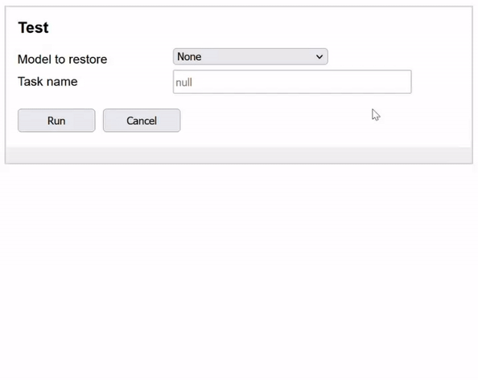
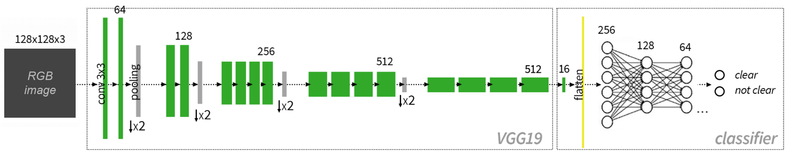

# Deploy deep learning model with Flask, jQuery, Celery, SocketIO and Docker

Simple web application designed with to setup the server, client sides and the communication inbetween. 
The template is a good starting base for building an application asynchronous processing of long tasks,
with continuous streaming of information from the long-running processes to client side. The client-server
communication is handled via websockets and (custom) event-driven backend message handlers operating
with threading and queue objects.

* **Server:** Flask, Flask-SocketIO, Celery

* **Client:** jQuery, AJAX, SocketIO

## Example of service

Testing a trained deep learning model:



Deep learning model architecture (implemented with TensorFlow)



Weights and training summaries are saved locally in folders. Previous model variables can be loaded prior
to initiating a service from the learning model.

## Included

* REST API
* Async server with Celery
* jQuery for responsive UI
* AJAX for client-server interactions
* Tensorflow model to train and test (as a service)
* Websocket API
* MySQL database
* Redis used for message queue
* Threading with custom message handler (for client-side info streaming)
* Docker containerization

## Usage

Run with Docker compose:
```
$ docker-compose up --build
```
Then, open `http://127.0.0.1:5051/` in your web-browser. Docker Desktop must be running.

Simple architecture:

