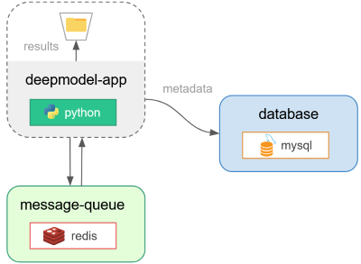

# Deploy deep learning model with Flask, jQuery, Celery, SocketIO and Docker

Simple web application with deep learning services (_Train_ and _Test_). The template is a good starting 
base for building an application with asynchronous processing of long tasks,
and continuous streaming of information from the long-running processes to client side. The server/client
communication is handled via a websocket and (custom) event-driven backend message handlers operating
with threading and queue objects.

* **Server:** Flask, Flask-SocketIO, Celery

* **Client:** jQuery, AJAX, SocketIO

## Example of service

Testing a trained deep learning model:


Deep learning model architecture (implemented with TensorFlow)


Weights and training summaries are saved locally. Previous model variables can be loaded prior
to initiating a service from the learning model. The module processes 1 task at a time per services, 
e.g. the _run_ button of service _Test_ becomes unavailable after pushing it as long as the task is not
terminated. Multiple services (with their respective task) can operate in parallel depending on the 
server resource. Note that if the page if reloaded or closed, all active tasks are cancelled.

## Included

* REST API
* Async server with Celery
* jQuery for responsive UI
* AJAX for client-server interactions
* Tensorflow model to train and test (as a service)
* Websocket API
* MySQL database
* Redis used for message queue
* Threading with custom message handler (for client-side info streaming)
* Docker containerization

## Usage

Architecture considered:



Run with Docker compose:
```
$ docker-compose up --build
```
Then, open `http://127.0.0.1:5051/` in your web-browser. Docker Desktop must be running.